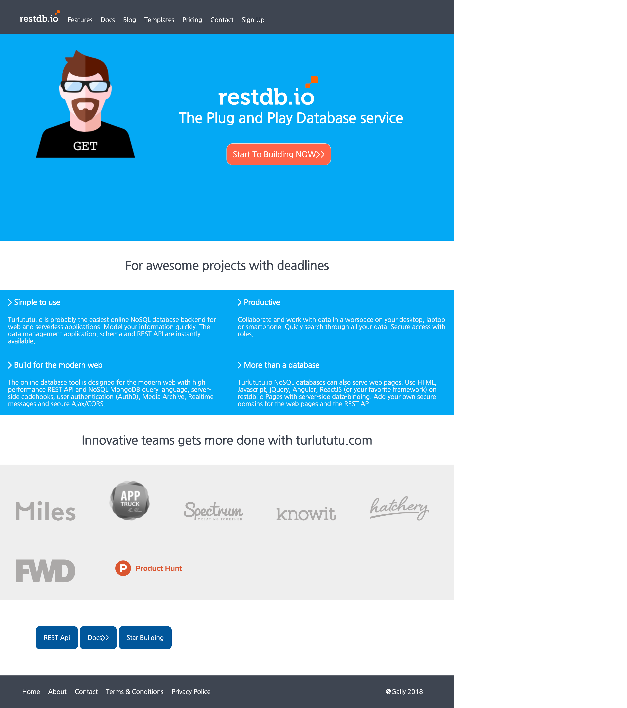

## Progresive Enhancement

Creator: **Meilyn Andrade**

Where: **BeCode** [Junior Web Developper]

When: **January 2019** 

Website: 
1. Exercice [Turlututu](https://meilyn.github.io/progressive-enhancement/Turlututu/index.html)
2. Exercice [Le Paysan Chinois](https://meilyn.github.io/progressive-enhancement/)

Status: **In progress**

## Languages ​​used
* HTML & CSS

## Projet

Progressive Enhancemebnt with HTML & CSS.`

**Instructions**: [Jhonson](https://github.com/becodeorg/BXL-Johnson-3.9/tree/master/Projets/progressive-enhancement)

## Objectives

* HTML & CSS
* HTML semantics
* SEO
* Accesibility
* HTML tags
* Attributes
* CSS syntax
* CSS selectors
* Positioning in CSS

# SKILL

## Le Paysan Japonais
 

## Turlututu [Bonus]
